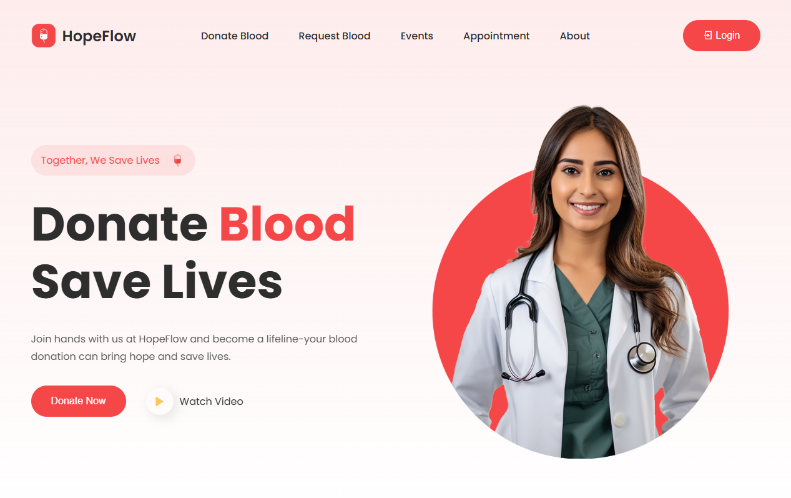
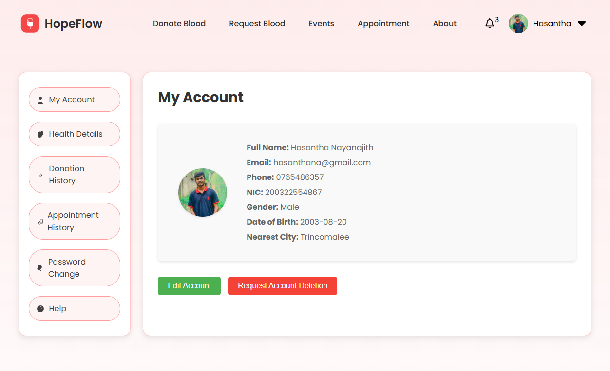
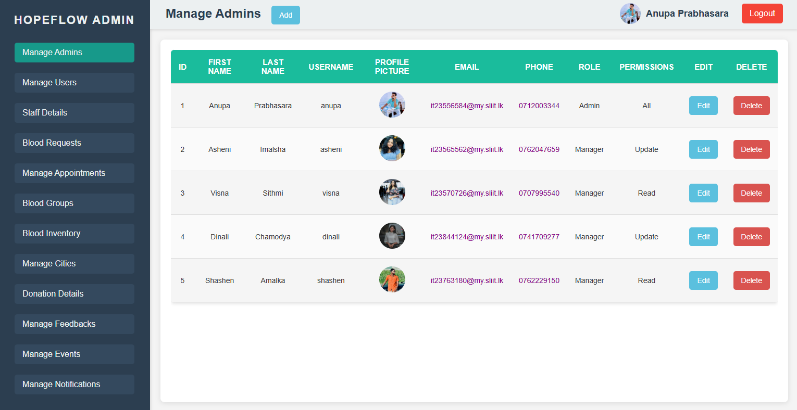

# Blood Donation Website

## Overview

This is a full-stack Blood Donation Website project designed to facilitate blood donation and management. The website includes functionalities for both clients (users) and administrators. Users can register, donate blood, view donation history, and track their contributions, while administrators manage the overall platform, including donor management, blood bank management, and more.

## Technologies Used

- **Frontend**:
  - **HTML5**
  - **CSS3**
  - **JavaScript** (with AJAX and jQuery for dynamic interactions)

- **Backend**:
  - **PHP**
  - **MySQL** for database management

## Features

### Client Side Interface

1. **User Registration and Login**: 
   - Users can create an account with personal details such as name, email, phone number, and address. 
   - Secure authentication using sessions and hashing.

2. **Blood Donation**:
   - Users can donate blood through a simple form.
   - Fields include blood type, quantity, and any additional medical conditions.

3. **Dashboard**: 
   - Personalized dashboard for users to track donations, view history, and manage profiles.
   - Includes graphs, progress bars, and visual statistics for donation activity.

4. **Real-Time Updates**: 
   - Using AJAX and jQuery for dynamic updates (e.g., displaying latest blood needs, donation records).

### Admin Interface

1. **Donor Management**:
   - Add, edit, and delete donor records.
   - View comprehensive details for each donor.

2. **Blood Bank Management**: 
   - Track and manage available blood stocks (e.g., A+, B-, O+, etc.).
   - Real-time updates of blood bank data.

3. **Reports and Statistics**:
   - Generate reports and visual analytics on blood donations and usage.

4. **User Management**:
   - Manage user roles, permissions, and access control for security purposes.

## Database Schema

- **Tables**:
  - `users`: Stores user details (ID, name, email, password, etc.).
  - `donations`: Logs donation data (user_id, blood_type, quantity, timestamp).
  - `blood_stock`: Manages blood inventory (blood_type, quantity).

## Design Features

- **Responsive Design**: 
  - The website adapts to various screen sizes using CSS media queries.
  
- **Icons and Emojis**: 
  - Utilization of modern icons and emojis to enhance user experience.

- **AJAX for Real-time Functionality**: 
  - Enhances user interaction with minimal page reloads.

## Screenshots/Images

### Home Page


### User Dashboard


### Admin Interface


## Getting Started

1. **Download the database**:
   ```bash
   https://github.com/anupaprabhasara/SLIIT-IWT-Project-2024/raw/main/database/hopeflow.sql
   ```

2. **Live preview**:
   ```bash
   https://iwtproject.anupa.lk/
   ```

3. **Setup Database**:
   - Import the SQL file from the `/database` folder.
   - Update the database connection in `conn.php`.

4. **Configure**:
   - Update `conn.php` file with database credentials.

5. **Run**:
   - Start the development server.

## Contributing

Contributions are welcome! Feel free to fork the project, make changes, and submit a pull request.

## License

This project is licensed under the GNU General Public License.

---

**Happy Donating! ❤️**
